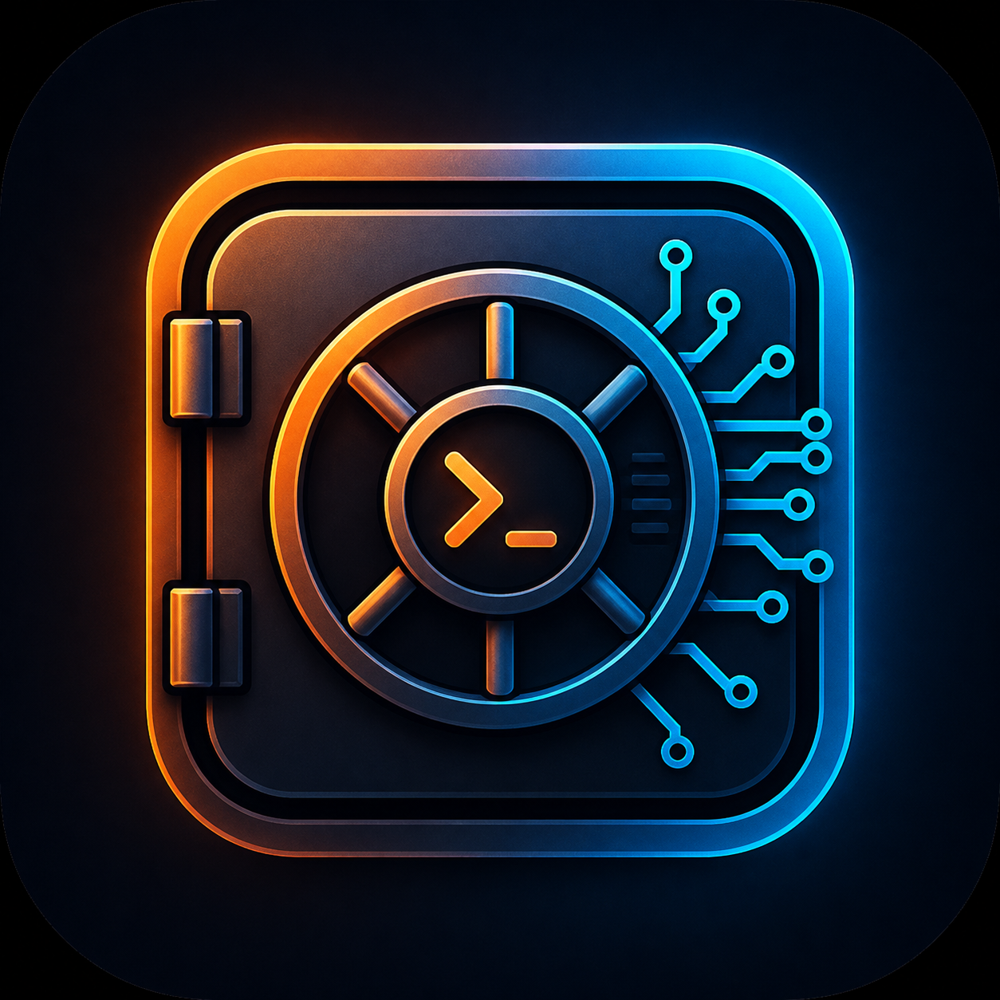
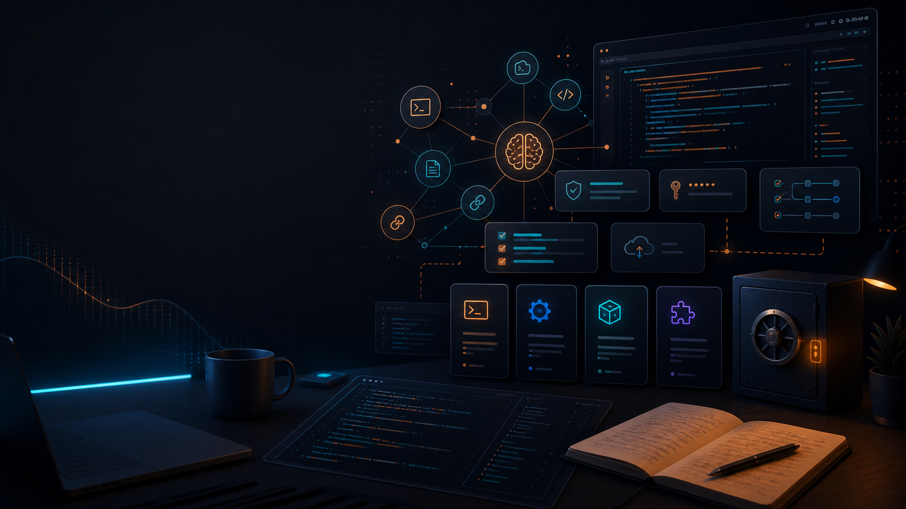
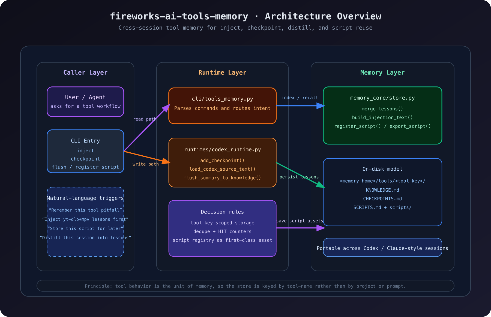
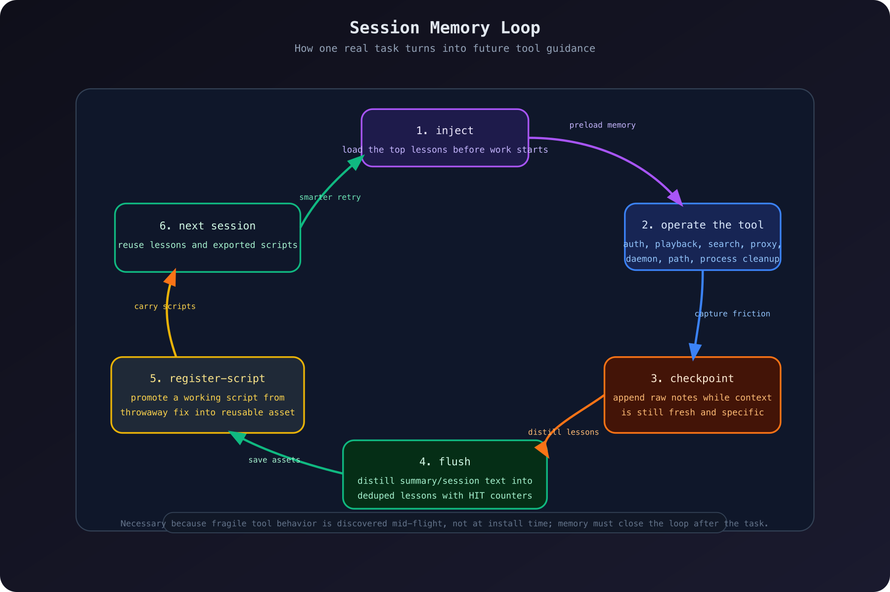
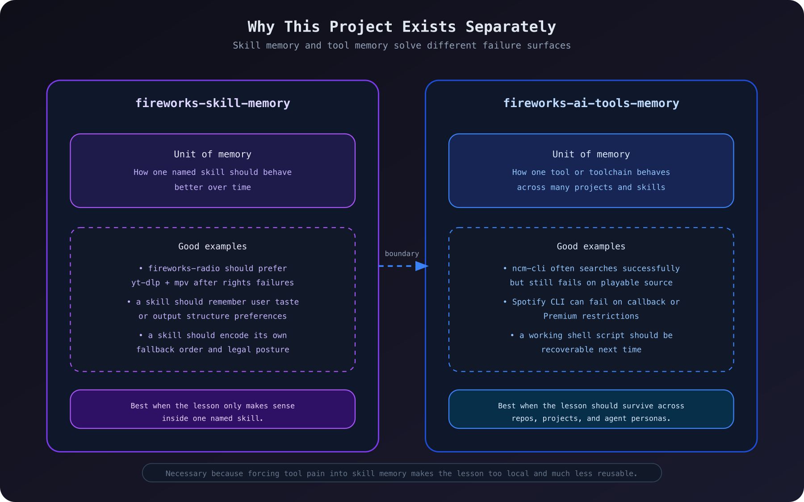

<div align="center">



<br />

# fireworks-ai-tools-memory

**Persistent experience memory for AI tools, CLI workflows, and reusable scripts.**

This project extends the memory idea beyond skills and focuses on the messier operational layer: tools, toolchains, auth quirks, proxy rules, fallback paths, and scripts that already paid their tuition once.

[中文文档](README.zh-CN.md) · [MIT License](LICENSE)

</div>



---

## Natural-Language Installation

If you mainly work through Codex, the most natural install flow is to ask for it directly instead of starting from shell commands:

- `Install fireworks-ai-tools-memory`
- `Add fireworks-ai-tools-memory to my current Codex environment`
- `Make this a shared skill so all my Codex accounts can use it`

The command-line path is just the fallback:

```bash
npx skills add yizhiyanhua-ai/fireworks-ai-tools-memory
```

If you already cloned the repository locally, you can also bootstrap it with:

```bash
./install-codex.sh
```

## Common Natural-Language Requests

This skill is most useful when you want to stop relearning the same tool pain:

- `Inject the yt-dlp+mpv lessons before we start`
- `Remember what went wrong with ncm-cli this time`
- `Store this script in the tool memory library`
- `Warn me about Spotify CLI auth pitfalls next time`
- `Flush the tool lessons from this session`

Typical CLI commands underneath:

```bash
python3 cli/tools_memory.py inject --tool yt-dlp+mpv
python3 cli/tools_memory.py checkpoint --tool ncm-cli --note "Search may work while playback still fails."
python3 cli/tools_memory.py flush --tool spotify-cli --summary-file ./session-summary.md
python3 cli/tools_memory.py register-script --tool yt-dlp+mpv --source ./scripts/play_mix.sh --name play-mix
python3 cli/tools_memory.py list-scripts --tool yt-dlp+mpv
python3 cli/tools_memory.py export-script --tool yt-dlp+mpv --name play-mix --dest /tmp/play_mix.sh
```

## Why Build This

`fireworks-skill-memory` solves one problem well: skill-scoped experience.

But a lot of expensive repetition does not happen at the skill layer.
It happens at the tool layer:

- one CLI searches correctly but cannot actually play
- another tool authenticates halfway then dies on callback behavior
- a daemon only works with home-directory symlinks, not external volume paths
- a script already solved the issue once, but nobody remembers where it is

Those are not “prompting mistakes.”
They are operational lessons.

`fireworks-ai-tools-memory` exists to store them explicitly.

More bluntly: many failures are not model failures. They are tool-reality failures. Auth, proxies, path quirks, media rights, background daemons, callback URLs, process cleanup, and argument order all have to be remembered somewhere durable.

## What It Covers

- Tool-specific pitfalls
- Best-practice invocation sequences
- Fallback chains
- Proxy and environment requirements
- Reusable scripts worth saving
- Cross-session tool playbooks for Codex or Claude Code

## Technical Principles

The project does three plain but necessary things:

1. It changes the memory unit from “skill” to “tool key”  
   The point is to remember `ncm-cli`, `spotify-cli`, or `yt-dlp+mpv`, not just a prompt shape.
2. It turns temporary session pain into structured files  
   `CHECKPOINTS.md` keeps raw field notes, `KNOWLEDGE.md` keeps reusable lessons, and `SCRIPTS.md` plus `scripts/` preserve working assets.
3. It closes the loop across sessions  
   `inject` before work, `checkpoint` during work, `flush` after work, and `register-script` when a fix deserves to survive.

### 1. Overall architecture



This diagram shows the core split:

- the caller layer expresses intent but does not own memory
- the CLI and runtime route intent into concrete operations
- the store layer persists lessons, checkpoints, and scripts
- the stable memory object is the `tool-key`, not the repo or a one-off prompt

### 2. How a real task becomes future guidance



The important part happens during real work, not at install time:

- `inject` reloads prior lessons before a task begins
- `checkpoint` captures raw friction while the details are still fresh
- `flush` distills reusable lessons from a summary or session record
- `register-script` promotes a working fix into a durable asset

That is why this project is necessary. Toolchain failures usually show up mid-flight, and by the end of a session the specific details are often gone.

### 3. Why it must stay separate from fireworks-skill-memory



This separation is not aesthetic; it protects reuse:

- `fireworks-skill-memory` should remember a named skill's strategy, preferences, and output behavior
- `fireworks-ai-tools-memory` should remember cross-skill tool behavior, failure patterns, and scripts

If tool pain gets forced into skill memory, the lesson becomes too local and much less reusable.

## Storage Model

```text
<memory-home>/
├── global/KNOWLEDGE.md
└── tools/
    └── <tool-key>/
        ├── KNOWLEDGE.md
        ├── CHECKPOINTS.md
        ├── SCRIPTS.md
        └── scripts/
            └── <saved-script>
```

## Tool Keys

Use stable keys such as:

- `ncm-cli`
- `spotify-cli`
- `yt-dlp+mpv`
- `lark-cli`
- `paseo`
- `browser-use`

## Codex Workflow

### Inject memory before a task

```bash
python3 cli/tools_memory.py inject --tool yt-dlp+mpv
```

### Save a checkpoint during work

```bash
python3 cli/tools_memory.py checkpoint \
  --tool ncm-cli \
  --note "Search may work while playback still fails because the song has no playable source."
```

### Distill lessons after a session

```bash
python3 cli/tools_memory.py flush \
  --tool spotify-cli \
  --summary-file ./session-summary.md
```

### Save a reusable script

```bash
python3 cli/tools_memory.py register-script \
  --tool yt-dlp+mpv \
  --source ./scripts/play_mix.sh \
  --name play-mix \
  --description "Start a short coding mix through mpv."
```

### List and export saved scripts

```bash
python3 cli/tools_memory.py list-scripts --tool yt-dlp+mpv
python3 cli/tools_memory.py export-script \
  --tool yt-dlp+mpv \
  --name play-mix \
  --dest /tmp/play_mix.sh
```

## What Makes It Different

This is not a generic notes bucket.

It is opinionated:

- Tool memory should be keyed by the actual runtime object that fails
- Lessons should be short, operational, and reusable
- Fallbacks are first-class knowledge
- Scripts are assets, not side notes

## Relationship to fireworks-skill-memory

- `fireworks-skill-memory`: remember how to use a skill better
- `fireworks-ai-tools-memory`: remember how to operate tools better

They are complementary, not redundant.

## Repository Assets

```text
fireworks-ai-tools-memory/
├── assets/
│   └── images/
│       ├── fireworks-ai-tools-memory-icon.png
│       └── fireworks-ai-tools-memory-landing.png
├── docs/
│   └── diagrams/
│       ├── architecture-overview.svg
│       ├── architecture-overview.png
│       ├── session-memory-loop.svg
│       ├── session-memory-loop.png
│       ├── skill-boundary.svg
│       └── skill-boundary.png
```
